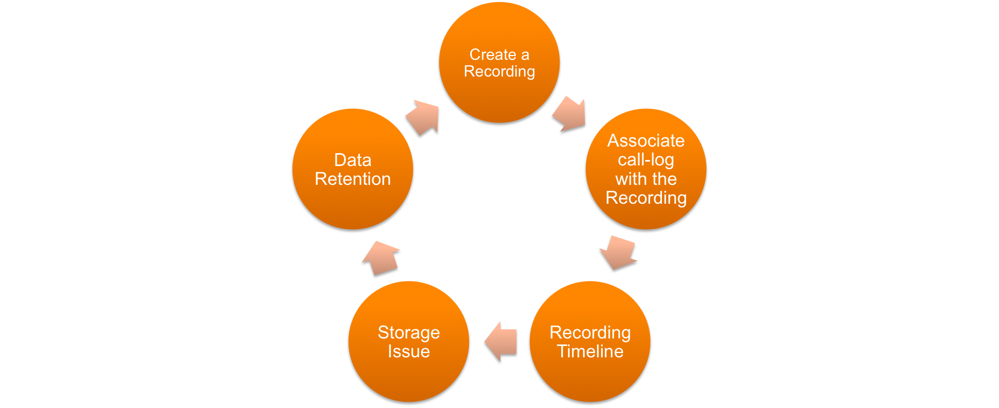

# Sample-Demo-to-Download-Call-Recordings - BETA
A Sample PHP command line application to : Generate Call Records ( with / without Recordings ) , download call logs , upload recordings to Amazon S3 Bucket, Dropbox

**Please Keep in mind that this is not a Production ready Application but just a sample demo**

 
 

# Requirements

- PHP 5.3.29+
- Composer
- CURL Extension

# Configuration Requirements

- What is the hourly interval/ range when they would like to pull down the recordings
- What is the approximate call-recordgins count per day
- The total number of accounts and the details

# Installation


## Clone the Repository **( Recommended )**

```sh
$ git clone https://github.com/anilkumarbp/RingCentral-Call-Generator-Recordings-Downloader.git
```

Cd into `RingCentral-Call-Generator-Recordings-Downloader`. Run the Composer command to install the packages
 
```sh
$ composer install
```

Create a `.env` file within the same folder and the contents as **shown below** and configure your RingCentral Account details:

For ex: To run callRecording.php script make `RC_SkipDownload= False`
		To skip callRecording.php script make `RC_SkipDownload= True` 

```php

RC_AppKey= 							
RC_AppSecret= 
RC_Server= 
RC_Username= 
RC_Extension= 
RC_Password= 
RC_fromPhoneNumber= 
RC_toPhoneNumber= 
RC_dateFrom= 
RC_dateTo= 
RC_callRecordingsCount= 
amazonAccessKey= 
amazonSecretKey= 
dropBoxkey= 
dropBoxsecret= 
RC_SkipCallLog=           
RC_SkipRingOut=         
RC_SkipDownload=     
RC_SkipDownloadS3= 
RC_SkipDownloadDropbox=  

```

Then execute:

```sh
$ php index.php
```


## Using the PHAR package 

Download the PHAR file: [`Click Here for PHAR file`](https://github.com/anilkumarbp/RingCentral-Call-Generator-Recordings-Downloader/releases/download/0.1.2/RC_CallRecordings_Download.phar)

```sh
$ wget https://github.com/anilkumarbp/RingCentral-Call-Generator-Recordings-Downloader/releases/download/0.1.2/RC_CallRecordings_Download.phar
```

cd into the folder where the PHAR file is downloaded and create a .env file as shown above: (alternatively you could create a .env using the vi editor)

```php
$ vim .env
```
copy the contents from `.env.example` into `.env` file as below and enter the RC account details:
```php

RC_AppKey= 							
RC_AppSecret= 
RC_Server= 
RC_Username= 
RC_Extension= 
RC_Password= 
RC_fromPhoneNumber= 
RC_toPhoneNumber= 
RC_dateFrom= 
RC_dateTo= 
RC_callRecordingsCount= 
amazonAccessKey= 
amazonSecretKey= 
dropBoxkey= 
dropBoxsecret= 
RC_SkipCallLog=           
RC_SkipRingOut=         
RC_SkipDownload=     
RC_SkipDownloadS3= 
RC_SkipDownloadDropbox=  

```

Execute the PHAR file

```php
$ php RC_CallRecordings_Download.phar
```


# Basic Usage

## Generate Call Recordings

```php
require(__DIR__ . '/demo/ringout.php');
```

Aim : To generate sample call recordings you would need to use the ringout.php file. 
Pre-requisite : Before you initiate a RingOut, make sure to add a "Announcement-Only-Extension" and associate a digital line / direct line attached to it.
Make sure to use this number as both the "fromPhoneNumber" and "toPhoneNumber" within the .env file ( /.env )
                
## Pull Down Call-Logs

```php
require(__DIR__ . '/demo/call_log.php');
```
Aim : To pull down call-logs in cycles of one business day ( 24 hours ) and save them as .json file
Pre-requisite : Before you initiate the call_log.php make sure to pass the "RC_dateFrom" filter in the .env file ( /.env )
Note : The call-log is designed to fetch 100 records per page.

## Save the call-recordings to Local File System

```php
require(__DIR__ . '/demo/callRecording.php');
```
Aim : Save the call-recordings to your local file system using file stream writer. Creates a directory called "Recordings" and the recordings are stored as .mp3 / .wav format.
Pre-requisite : Before you initiate the callRecording.php make sure to pass the "RC_dateFrom" filter in the .env file ( /.env )

## Save the call-recordings to Amazon S3 Bucket

```php
require(__DIR__ . '/demo/callRecording_S3.php');
```
Aim : Save the call-recordings to your Amazon S3 Buckets using amazon stream writer. Creates a directory called "Recordings" and the recordings are stored as .mp3 / .wav format.
Pre-requisite : Before you initiate the callRecording.php make sure to pass the "RC_dateFrom" filter in the .env file ( /.env )
```php
{
	"amazonAccessKey": "", 			// Amazon app key       
	"amazonSecretKey": ""			// Amazon app secret
}
```

## Save the call-recordings to DropBox

```php
require(__DIR__ . '/demo/callRecording_Dropbox.php');
```
Aim : Save the call-recordings to your Dropbox Application. Creates a directory called "Recordings" and the recordings are stored as .mp3 / .wav format.
Pre-requisite : Before you initiate the callRecording_Dropbox.php make sure to pass the "dropBoxkey" and "dropBoxsecret" within the .env file ( /.env )

```php
{
	"dropBoxkey": "", 			// Dropbox app key       
	"dropBoxsecret": ""			// Dropbox app secret
}
```


Please take a look in `demo` folder to see all the demo scripts.


## Links

Project Repo

* https://github.com/anilkumarbp/RingCentral-Call-Generator-Recordings-Downloader

RingCentral SDK for PHP

* https://github.com/ringcentral/ringcentral-php

RingCentral API Docs

* https://developers.ringcentral.com/library.html

RingCentral API Explorer

* http://ringcentral.github.io/api-explorer

## Contributions

Any reports of problems, comments or suggestions are most welcome.

Please report these on [RingCentral-Call-Generator-Recordings-Downloader's Issue Tracker in Github](https://github.com/anilkumarbp/RingCentral-Call-Generator-Recordings-Downloader/issues).

## License

RingCentral SDK is available under an MIT-style license. See [LICENSE.txt](LICENSE.txt) for details.

RingCentral SDK &copy; 2016 by RingCentral

## FAQ

* What if I do not have a RingCentral account? Don't have an account, no worries: [Become a RingCentral Customer](https://www.ringcentral.com/office/plansandpricing.html)
* I/My company is an Independent Software Vendor (ISV) who would like to integrate with RingCentral, how do I do that? You can apply to [Join the RingCentral Partner Program](http://www.ringcentral.com/partner/isvreseller.html)

